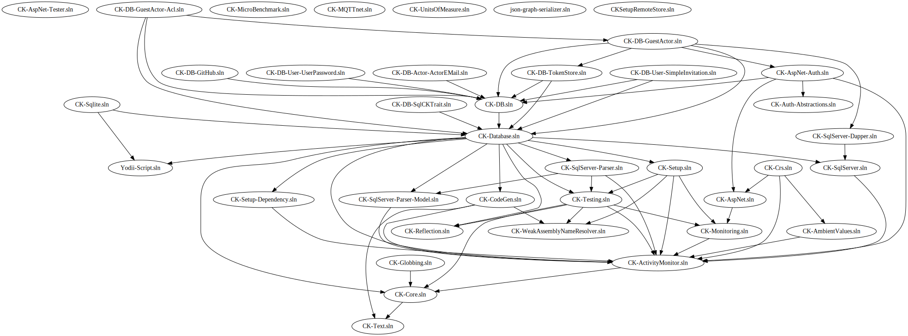

# Common usage

## Build

Building and Releasing all the repositories of a World without tooling take a lot of time. You must build each repositories, following the dependency order, and update the version of the now updated package. 
You can see below a Dependency Graph from the CK World, it show nicely the complexity and time required to do a complete build of a whole stack.


There is so much repositories that the graph itself is unreadable !

Hopefully, CKli solve these issues with a command: 
`World/AllBuild` 
Following the dependency order, it will commit the dependencies bumps, then execute the CI script.

This command have two parameters: 

```bash
 [default value: False] - rebuildAll:  
 [default value: True] - withUnitTest:
```

`withUnitTest` allow to choose to build without the unit tests. By default the builds are run with tests.

Running a CI build on all the stack can fail for a lot of reason, rebuilding everything take a lot of time, so CKli does not rebuild the repositories that was successfully built.

If you set `rebuildAll` to true, CKli will flush the previous builds and rebuild everything from scratch.

In depth information about the AllBuild is available [here](AllBuild.md).

## Publish

When the AllBuild script ran, CKli gave arguments to the CI script, telling it to push the Generated Artifacts in a Folder called "LocalFeed"
You can simply run `World/PublishCI` to publish these artifacts to their CI feeds (defined in the World.xml config file), and push the Repositories.

## Secrets

Each time you do an operation that require you to be authenticated on a service, like cloning a private repository on GitHub, CKli require a secret to operate.   
At any moment, you can list the secrets by running the command `secret`.


Secret that are actually present are green(We doesn't check if your secret is valid yet).

You don't need a read PAT if you have a PAT that provide read&write, that why GITHUB_GIT_PAT is dark green: the permissions he allow are included in the GITHUB_GIT_WRITE_PAT.

Secret that are missing are in red. Not every secrets are required to use CKli, fill only what you think that will be useful.

## Projects Auto Configuration

CKli can configure for you a lot of settings. There is a bunch of commands that allow you to do this, all of these commands contain the string "ApplySettings", using  [commands filtering](#commands-filtering) you can run all these commands by running `run *applysettings*`.

CKli got a command for Auto Configuring the following files (The link lead to the specific autoconfig doc) :  

- [appveyor.yml](In_Depth/CIAutoConfig.md)
- [.gitlab-ci.yml]((In_Depth/CIAutoConfig.md))
- CodeCakeBuilder
- CodeCakeBuilderKeyVault
- Common Folder
- Shared.props
- .gitignore
- nuget.config
- Repository.xml
- .editorconfig
- CKSetupStore
- global.json
- NPMSolution.xml
- .npmrc  

This auto configuration allow to: 

- Have the configuration consistent across repositories
- Reduce platform adherence

## Commands Filtering

The commands run and list run against a 

The command names are like a path, and can be very long, for example, for exemple :

`Yodii-Projects/Yodii-Script/branches/develop/Common/ApplySettings`

The commands names are case insensitive, and you can filter them with a widlcard pattern.

`list yodii*common*apply*` will return

```
Available Commands matching 'yodii*common*apply*':
     Yodii-Projects/Yodii-Script/branches/develop/Common/ApplySettings
```

## Managing External Dependencies

### Displaying External Dependencies

You can display external dependencies with the command `World/ShowExternalDependencies`.

The version in green with a left arrow are possible upgrade, version in white with a right arrow are version actually installed.
If multiple versions of the same package is installed, the version are colored in yellow.

### Upgrading External Dependencies

You can upgrade the dependencies accross the stack simply, with the command `World/UpgradeDependency`.

You just have to give the package name in the parameter, and optionally the package version. If the package version is not provided, the best version used in the stack will be used.


