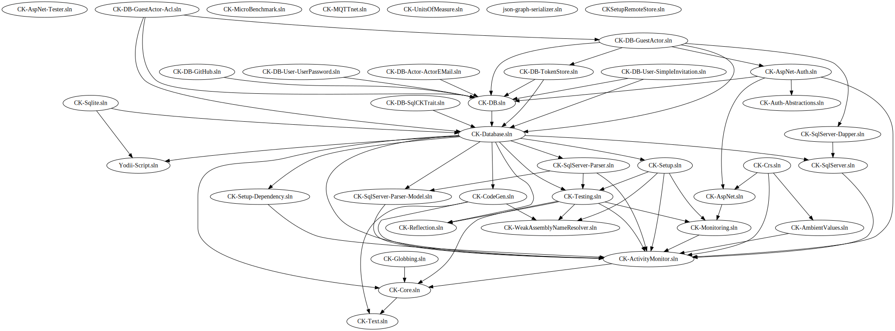

# Common usage

## Build

Building and Releasing all the repositories of a World without tooling take a lot of time. You must build each repositories, following the dependency order, and update the version of the now updated package. 
You can see below a Dependency Graph from the CK World, it show nicely the complexity and time required to do a complete build of a whole stack.


There is so much repositories that the graph itself is unreadable !

Hopefully, CKli solve these issues with a command:  
`World/AllBuild`   
Following the dependency order, it will commit the dependencies bumps, then execute the CI script.

This command have two parameters: 

```bash
 [default value: False] - rebuildAll:  
 [default value: True] - withUnitTest:
```

`withUnitTest` allow to choose to build without the unit tests. By default the builds are run with tests.

Running a CI build on all the stack can fail for a lot of reason, rebuilding everything take a lot of time, so CKli does not rebuild the repositories that was successfully built.

If you set `rebuildAll` to false, CKli will flush the previous builds and rebuild everything from scratch.

In depth information about the AllBuild is available here: [here](AllBuild.md).

## Publish
When the AllBuild script ran, CKli gave arguments to the CI script, telling it to push the Generated Artifacts in a Folder called "LocalFeed"
You can simply run `World/PublishCI` to publish these artifacts to their CI feeds (defined in the World.xml config file), and push the Repositories.


## Secrets
Each time you do an operation that require you to be authenticated on a service, like cloning a private repository on GitHub, CKli require a secret to operate.   
At any moment, you can list the secrets by running the command `secret`.


Secret that are actually present are green(We doesn't check if your secret is valid yet).

You don't need a read PAT if you have a PAT that provide read&write, that why GITHUB_GIT_PAT is dark green: the permissions he allow are included in the GITHUB_GIT_WRITE_PAT.

Secret that are missing are in red. Not every secrets are required to use CKli, fill only what you think that will be useful.

## Projects Auto Configuration

CKli can configure for you a lot of settings. There is a bunch of commands that allow you to do this, all of these commands contain the string "ApplySettings", using  [commands filtering](#commands-filtering) you can run all these commands by running `run *applysettings*`.

CKli got a command for Auto Configuring the following files (The link lead to the specific autoconfig doc) :  

-  [appveyor.yml](In_Depth/CIAutoConfig.md)
- [.gitlab-ci.yml]((In_Depth/CIAutoConfig.md))
- CodeCakeBuilder
- CodeCakeBuilderKeyVault
- Common Folder
- Shared.props
- .gitignore
- nuget.config
- Repository.xml
- .editorconfig
- CKSetupStore
- global.json
- NPMSolution.xml
- .npmrc  

This auto configuration allow to: 

- Have the configuration consistent across repositories
- Reduce platform adherence

## Commands Filtering

The commands run and list run against a 

The command names are like a path, and can be very long, for example, for exemple :

`Yodii-Projects/Yodii-Script/branches/develop/Common/ApplySettings`

The commands names are case insensitive, and you can filter them with a widlcard pattern.

`list yodii*common*apply*` will return

```
Available Commands matching 'yodii*common*apply*':
     Yodii-Projects/Yodii-Script/branches/develop/Common/ApplySettings
```

